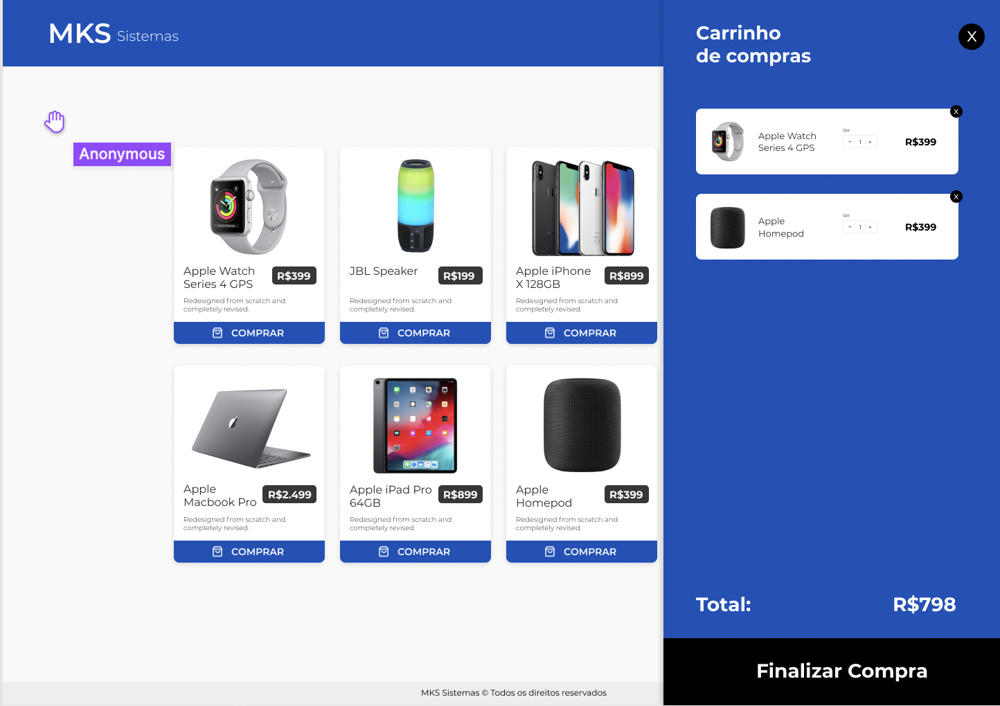

 

 

> <h2> Tecnologias 🔥</h2>

<ul>
    <li><a href='https://pt-br.reactjs.org/'>React / Vite</a></li>
    <li><a href='https://www.typescriptlang.org/'>Typescript</a></li>
    <li><a href='https://redux.js.org/'>Redux</a></li>
</ul>

 

> <h2> Projeto ✨</h2>

O objetivo principal desse teste é avaliar sua capacidade de escrever código limpo, bem testado e reutilizável.

 

> <h2>Executando o projeto 🚀</h2>

    <ol>
    <li> Clone o repositório </l1>
    <li> Instale o <a href='https://yarnpkg.com/'><code>yarn</code></a>
    <li> Instale as dependências também com <a href='https://yarnpkg.com/'><code>yarn</code></a>
    <li> Inicie o projeto com <code>yarn dev</code>
    </ol>

 

> <h3> Considerações finais</h3>

    
Feito com muita dedição para testar minhas habilidades e passar no teste.

    
Por fim caso queira testar antes de instalar em sua máquina o projeto está hospedado em <a href='https://mks-front-challenge.vercel.app/'>https://mks-front-challenge.vercel.app/ </a>

